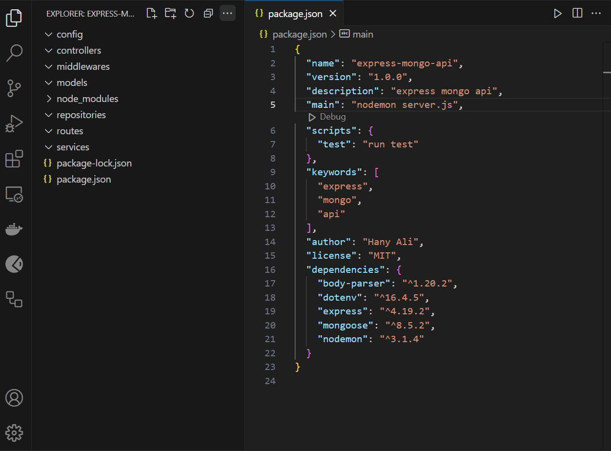

# Building an API with Express and MongoDB using SOA

In this tutorial, we'll build a RESTful API using Express and MongoDB, structured according to Service-Oriented Architecture (SOA) principles. SOA separates the application into distinct services that handle specific responsibilities, improving maintainability and scalability.

## Project Structure

Sure, here is the complete README.md file with the markdown code:

markdown

# Building an API with Express and MongoDB using SOA

In this tutorial, we'll build a RESTful API using Express and MongoDB, structured according to Service-Oriented Architecture (SOA) principles. SOA separates the application into distinct services that handle specific responsibilities, improving maintainability and scalability.

## Project Structure

```bash

express-mongo-api/
├── src/
│ ├── app.js
│ ├── config/
│ │ └── db.js
│ ├── server.js
│ ├── services/
│ │ └── userService.js
│ ├── repositories/
│ │ └── userRepository.js
│ ├── controllers/
│ │ └── userController.js
│ ├── models/
│ │ └── user.js
│ ├── routes/
│ │ └── userRoutes.js
│ └── middlewares/
│ ├── errorHandler.js
│ └── validateUser.js
├── .env
└── package.json

```
## Setting Up the Project

### 1. Initialize Your Project

```bash
mkdir express-mongo-api
cd express-mongo-api
npm init -y
```

### 2. Install Required Packages
```bash
npm install express mongoose body-parser dotenv nodemon
```

### 3. Create the Project Structure

You can use VS Code to create the project folder structure:
```bash
code .
```


Your folder structure should look like this

### Config Layer
Handles configuration settings, such as connecting to MongoDB.

config/db.js

```bash
const mongoose = require("mongoose");

const dbPath = process.env.MONGO_URI;

const connectDB = async () => {
  try {
    await mongoose.connect(dbPath);
    console.log("MongoDB connected");
  } catch (error) {
    console.error("Error connecting to MongoDB:", error);
    process.exit(1);
  }
};

module.exports = connectDB;
```

### Model Layer
Defines the data schema for MongoDB collections.

models/user.js

```bash
const mongoose = require('mongoose');

const userSchema = new mongoose.Schema({
  username: {
    type: String,
    required: true,
  },
  password: {
    type: String,
    required: true,
    minlength: 4,
  },
  email: {
    type: String,
    required: true,
    unique: true,
  }});

module.exports = mongoose.model('User', userSchema);
```
### Repositories Layer
Handles data access and interaction with the database.

repositories/userRepository.js

```bash
const User = require("../models/User");

const createUser = async (username, email, password) => {
  try {
    const user = new User({ username, email, password });
    await user.save();
    return user;
  } catch (err) {
    throw new Error(err.message);
  }
};

const findAllUsers = async () => {
  try {
    const users = await User.find();
    return users;    
  } catch (error) {
    throw new Error(error.message);    
  }
};

module.exports = {
  createUser,
  findAllUsers,
};
```

### Service Layer
Contains the business logic and communicates with the model layer.

services/userService.js

```bash
const userRepository = require('../repositories/userRepository');

const createUser = async (username, password, email) => {
  try {
    const user= await userRepository.createUser(username, password, email);
    return user;
  } catch (error) {
    throw new Error(error.message);
  }
};

const getUsers = async () => {
  try {
    const users = await userRepository.findAllUsers();
    return users;
  } catch (error) {
    throw new Error(error.message);
  }
};

module.exports = {
  createUser,
  getUsers,
};
```

### Controller Layer
Handles HTTP requests and uses the service layer to perform operations.

controllers/userController.js
```bash
const userService = require('../services/userService');

const createUser = async (req, res) => {
  try {
    
    const user = await userService.createUser(req.body.username, req.body.password, req.body.email);
    res.status(201).json(user);
    
  } catch (error) {
    res.status(500).json({ message: error.message });  
  }
};

const getUsers = async (req, res) => {
  try {
    const users = await userService.getUsers();
    res.status(200).json(users);
  } catch (error) {
    res.status(500).json({ message: error.message });
  }
};

module.exports = {
  createUser,
  getUsers,
};
```

### Route Layer
Defines the endpoints and associates them with controllers.

routes/userRoutes.js
```bash
const express = require('express');
const router = express.Router();
const userController = require('../controllers/userController');
const errorHandler = require('../middlewares/errorHandler');

router.post('/users', userController.createUser);
router.get('/users', userController.getUsers);

module.exports = router;
```

### Middleware Layer
Contains middleware functions such as error handling.
middlewares/errorHandler.js

```bash
const errorHandler = (err, req, res, next) => {
  console.error(err.stack);
  res.status(500).send({ message: err.message });
};

module.exports = errorHandler;
```
### Integrating Everything
Combines all layers to form the complete application.

server.js
```bash
const express = require('express');
const bodyParser = require('body-parser');
const connectDB = require('./config/db');
const userRoutes = require('./routes/userRoutes');
const errorHandler = require('./middlewares/errorHandler');
require('dotenv').config();

const app = express();

// Connect to MongoDB
connectDB();

// Middleware
app.use(bodyParser.json());

// Routes
app.use('/api', userRoutes);

// Error Handling Middleware
app.use(errorHandler);

const port = process.env.PORT || 5000;

// Start the server
app.listen(port, () => {
    console.log(`Server is running on port ${port}`);
});
```

### Running the Server
```bash
express-mongo-api> npm start
```
### Testing the API
You can use post man to get and create users


<p style="text-align: center;">get all users</p>


<p style="text-align: center;">Create new user</p>