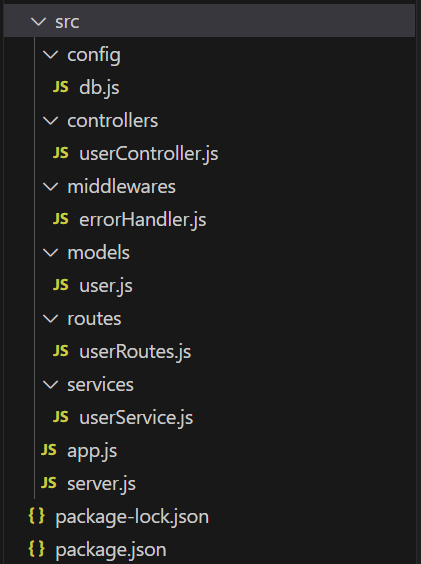
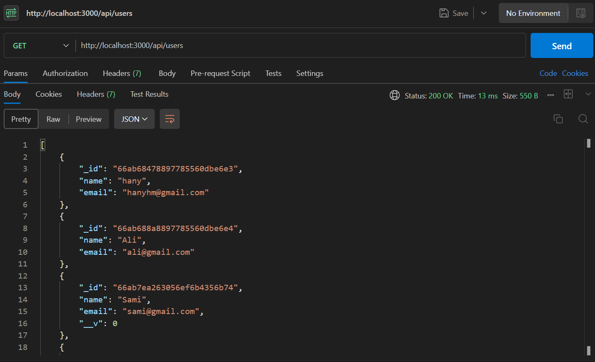
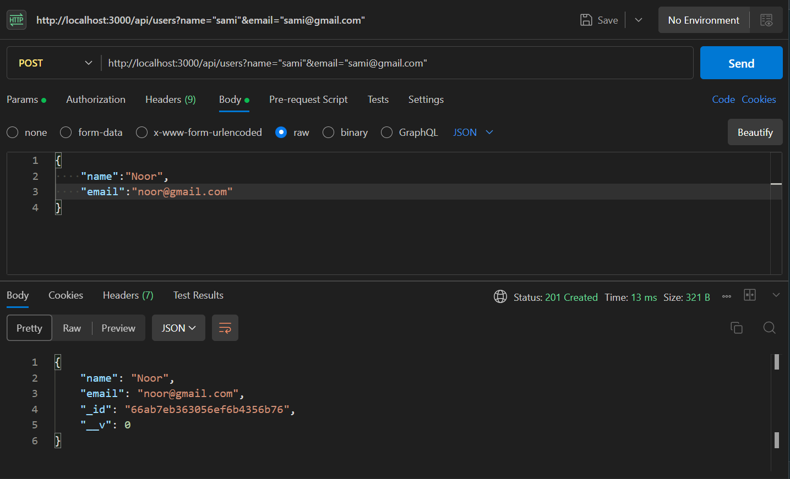

# Building an API with Express and MongoDB using SOA

In this tutorial, we'll build a RESTful API using Express and MongoDB, structured according to Service-Oriented Architecture (SOA) principles. SOA separates the application into distinct services that handle specific responsibilities, improving maintainability and scalability.

## Project Structure

```bash

express-mongo-api/
├── src/
│   ├── app.js
│   ├── config/
│   │   └── db.js
│   ├── server.js
│   ├── services/
│   │   └── userService.js
│   ├── controllers/
│   │   └── userController.js
│   ├── models/
│   │   └── user.js
│   ├── routes/
│   │   └── userRoutes.js
│   └── middlewares/
│       └── errorHandler.js
├── .env
└── package.json

```
## MongoDB
You must have MongoDB installed locally on your machine with sample datbase called mydb.

## Setting Up the Project

### 1. Initialize Your Project

```bash
mkdir express-mongo-api
cd express-mongo-api
npm init -y
```


### 2. Install Required Packages

```bash
npm install express mongoose body-parser dotenv nodemon
```

### 3. Create the Project Structure

You can use VS Code to create the project folder structure:

```bash
code .
```
#### Project Structure 


Create the project folder structure. Make sure to add the start script "start": "nodemon ./src/server.js" to the package.json file in order to be able to run the project.

### Config Layer

Handles configuration settings, such as connecting to MongoDB.

src/config/db.js

```bash
const mongoose = require('mongoose');
require('dotenv').config();

const connectDB = async () => {
  try {
    await mongoose.connect("mongodb://localhost:27017/mydb", {
    });
    console.log('MongoDB connected');
  } catch (error) {
    console.error('MongoDB connection error:', error);
    process.exit(1);
  }
};

module.exports = connectDB;
```

### Model Layer

Defines the data schema for MongoDB collections.

src/models/user.js

```bash
const mongoose = require('mongoose');

const userSchema = new mongoose.Schema({
  name: {
    type: String,
    required: true,
  },
  email: {
    type: String,
    required: true,
  },
});

module.exports = mongoose.model('User', userSchema);
```

### Service Layer

Contains the business logic and communicates with the model layer.

src/services/userService.js

```bash
const User = require('../models/user');

const createUser = async (userData) => {
  const user = new User(userData);
  return await user.save();
};

const getUsers = async () => {
  return await User.find();
};

module.exports = {
  createUser,
  getUsers,
};
```
### Controller Layer

Handles HTTP requests and uses the service layer to perform operations.

src/controllers/userController.js

```bash
const userService = require('../services/userService');

exports.createUser = async (req, res) => {
  try {
    const user = await userService.createUser(req.body);
    res.status(201).json(user);
  } catch (error) {
    res.status(400).json({ message: error.message });
  }
};

exports.getUsers = async (req, res) => {
  try {
    // Call the userService to get all users
    const users = await userService.getUsers();
    // Send the users as a response with a success status code
    res.status(200).json(users);
  } catch (error) {
    // If there's an error, send an error message with a server error status code
    res.status(500).json({ message: error.message });
  }
};
```

### Route Layer

Defines the endpoints and associates them with controllers.

src/routes/userRoutes.js

```bash
const express = require('express');
const router = express.Router();
const userController = require('../controllers/userController');

router.post('/users', userController.createUser);
router.get('/users', userController.getUsers);

module.exports = router;
```

### Middleware Layer

Contains middleware functions such as error handling.

src/middlewares/errorHandler.js

```bash
const errorHandler = (err, req, res, next) => {
    console.error(err.stack);
    res.status(500).send({ message: err.message });
  };
  
module.exports = errorHandler;
```

### Integrating Everything

Combines all layers to form the complete application.

src/app.js

```bash
const express = require('express');
const bodyParser = require('body-parser');
const connectDB = require('./config/db');
const userRoutes = require('./routes/userRoutes');
const errorHandler = require('./middlewares/errorHandler');

const app = express();

// Connect to MongoDB
connectDB();

// Middleware
app.use(bodyParser.json());

// Routes
app.use('/api', userRoutes);

// Error Handling Middleware
app.use(errorHandler);

module.exports = app;
```

src/server.js

```bash
const app = require('./app');
const port = process.env.PORT || 3000;

app.listen(port, () => {
  console.log(`Server is running on port ${port}`);
});
```

### Running the Server

```bash
express-mongo-api> npm start
```

### Testing the API

You can use Postman to get and create users.


    Get all users using GET method in Postman extension in VS Code.


    Create new user using POST method in Postman extension in VS Code.

